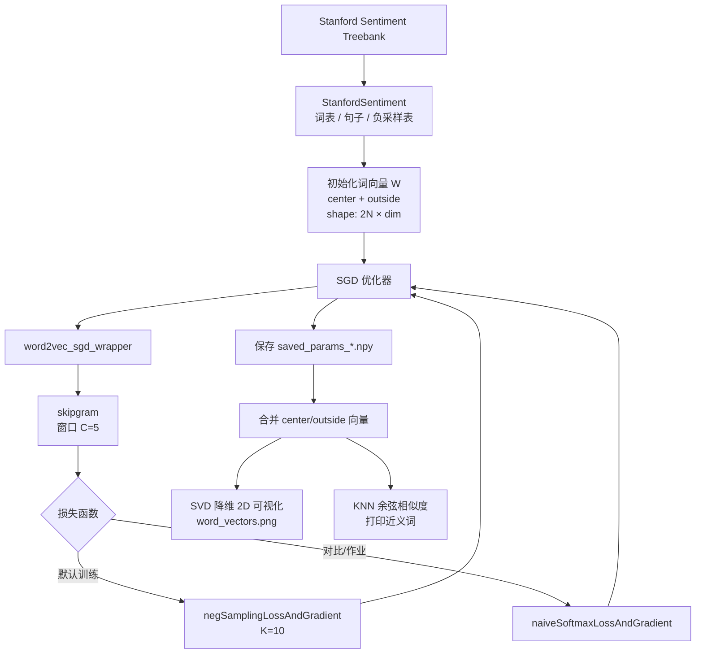
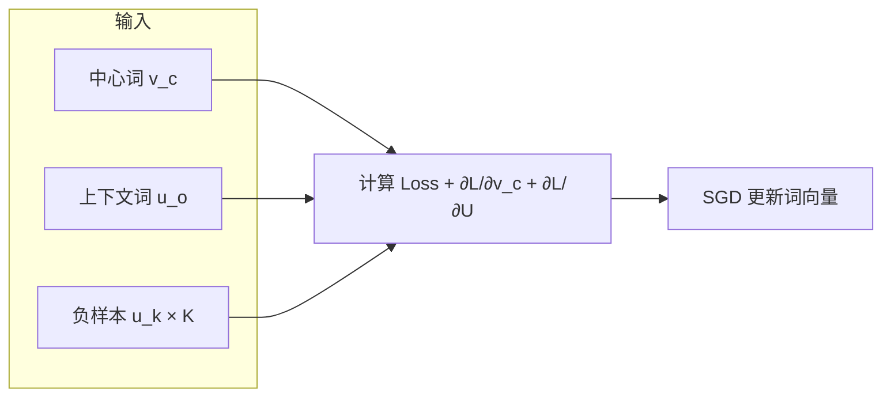

# Skipgram-notes 概览

本仓库是 **Word2Vec Skip-gram** 的学习笔记与实现（源自 CS224n Assignment 2 风格作业），在 Stanford Sentiment Treebank 语料上训练词向量，并做可视化与近邻检索。

## 做了什么

1. **实现 Skip-gram**：中心词预测上下文词；支持 Naive Softmax 与 Negative Sampling 两种损失。
2. **SGD 训练**：带学习率退火、定期保存 checkpoint（`saved_params_*.npy`）。
3. **数据**：`StanfordSentiment` 读取 SST，构建词表与负采样分布。
4. **评估 / 可视化**：SVD 将词向量投影到 2D；用余弦相似度 KNN 找近义词。
5. **笔记与证明**：`w2v_my_note.py` 记录负采样推导；根目录 `Prove_Report.pdf` 为数学证明。

## 核心模块

| 文件 | 作用 |
|------|------|
| `CODE/word2vec.py` | sigmoid、naive softmax / neg sampling loss、skipgram、SGD wrapper |
| `CODE/sgd.py` | 随机梯度下降与参数存取 |
| `CODE/run.py` | 端到端训练入口：初始化 → 训练 → 可视化 → KNN |
| `CODE/knn.py` | 基于余弦相似度的 K 近邻 |
| `CODE/utils/treebank.py` | SST 数据加载与采样 |
| `CODE/w2v_my_note.py` | 负采样实现笔记（注释版） |
| `CODE/env.yml` | Conda 环境（Python 3.7 + numpy/matplotlib） |

## 训练流程（Mermaid）



## Skip-gram 单步计算



## 如何运行

```bash
cd CODE
# 可选：conda env create -f env.yml && conda activate a2
# 可选：bash get_datasets.sh  # 若本地尚无 SST
python run.py
```

默认：`dimVectors=10`，窗口 `C=5`，约 40k 次 SGD；收敛后 cost 通常 ≤ 10。
