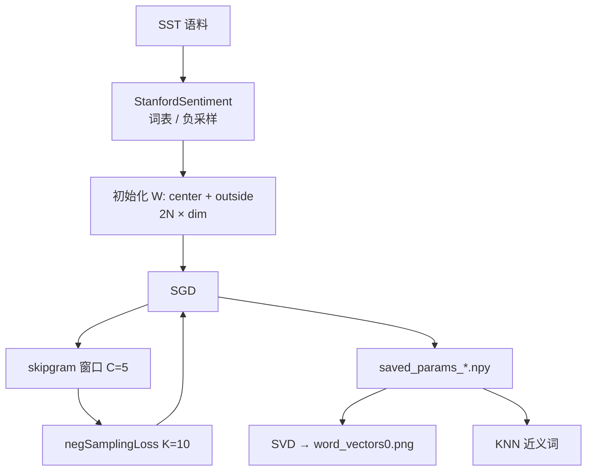

# Skipgram-notes

纯 NumPy 实现的 **Word2Vec Skip-gram**（CS224n A2），在 SST 上训练词向量，并做 2D 可视化与近义词检索。

## 做了什么

- 手写 Naive Softmax / Negative Sampling 损失与梯度
- SGD（学习率退火 + checkpoint）训练 10 维词向量
- SVD 投影可视化；余弦相似度 KNN 找近邻
- 数学证明见 `Prove_Report.pdf`；负采样笔记见 `CODE/w2v_my_note.py`

## 流程



## 模块

| 文件 | 作用 |
|------|------|
| `CODE/word2vec.py` | loss / skipgram / SGD wrapper |
| `CODE/sgd.py` | 优化器与断点续训 |
| `CODE/run.py` | 训练 → 可视化 → KNN |
| `CODE/knn.py` | 余弦相似度近邻 |
| `CODE/utils/treebank.py` | SST 加载与采样 |

## 运行

```bash
cd CODE
conda env create -f env.yml && conda activate a2
python run.py   # dim=10, C=5, 40k steps；已有 checkpoint 会自动续训
```
